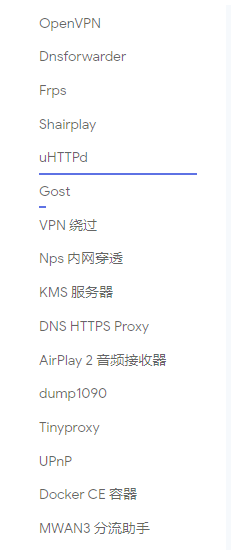
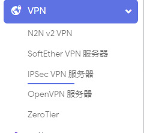

# AutoBuild-OpenWrt
基于[esirplayground/AutoBuild-OpenWrt](https://github.com/esirplayground/AutoBuild-OpenWrt)

IP：10.0.0.1   密码：password

集成一些linux 常用命令: lrzsz、jq、docker-compose、pip、node、git、替换了BusyBox的date命令等等

openssh替换了dropbear, nginx和uhttpd同时存在,默认uhttpd.   
./scripts/diffconfig.sh > seed.config


<details>

<summary><b>&nbsp;修改 config 文件</b></summary>

1. 首先装好 Linux 系统，推荐 Debian 11 或 Ubuntu LTS

2. 安装编译依赖环境

   ```bash
   sudo apt update -y
   sudo apt full-upgrade -y
   sudo apt install -y ack antlr3 asciidoc autoconf automake autopoint binutils bison build-essential \
   bzip2 ccache cmake cpio curl device-tree-compiler fastjar flex gawk gettext gcc-multilib g++-multilib \
   git gperf haveged help2man intltool libc6-dev-i386 libelf-dev libglib2.0-dev libgmp3-dev libltdl-dev \
   libmpc-dev libmpfr-dev libncurses5-dev libncursesw5-dev libreadline-dev libssl-dev libtool lrzsz \
   mkisofs msmtp nano ninja-build p7zip p7zip-full patch pkgconf python2.7 python3 python3-pyelftools \
   libpython3-dev qemu-utils rsync scons squashfs-tools subversion swig texinfo uglifyjs upx-ucl unzip \
   vim wget xmlto xxd zlib1g-dev
   ```

3. 下载源代码，更新 feeds 并安装到本地

   ```bash
   git clone https://github.com/coolsnowwolf/lede
   cd lede
   ./scripts/feeds update -a
   ./scripts/feeds install -a
   ```

4. 复制 diy-script.sh 文件内所有内容到命令行，添加自定义插件和自定义设置

5. 命令行输入 `make menuconfig` 选择配置，选好配置后导出差异部分到 seed.config 文件

   ```bash
   make defconfig
   ./scripts/diffconfig.sh > seed.config
   ```

7. 命令行输入 `cat seed.config` 查看这个文件，也可以用文本编辑器打开

8. 复制 seed.config 文件内所有内容到 configs 目录对应文件中覆盖就可以了

   **如果看不懂编译界面可以参考 YouTube 视频：[软路由固件 OpenWrt 编译界面设置](https://www.youtube.com/watch?v=jEE_J6-4E3Y&list=WL&index=7)**
</details>


<details>
<summary><b>&nbsp;更改内核版本</b></summary>
更改内核版本

1. 然后想编译哪个内核版本打开查看提交记录
```shell
github.com/coolsnowwolf/lede/commits/master/include/kernel-5.4
github.com/coolsnowwolf/lede/commits/master/include/kernel-5.10
github.com/coolsnowwolf/lede/commits/master/include/kernel-5.15
github.com/coolsnowwolf/lede/commits/master/include/kernel-6.1
github.com/coolsnowwolf/lede/commits/master/include/kernel-6.6
```
2. 然后在LEDE目录执行 git checkout xxxx
```
git checkout f221abf682d721f60e228f67eb4c94c32b5dd72c
```
4. 然后修改目标文件
```shell
cd lede/target/linux/x86
vim Makefile
KERNEL_PATCHVER:=6.6
```
Test 改不改无所谓。

编译前推荐先make dirclean

如果报错就make clean
</details>








