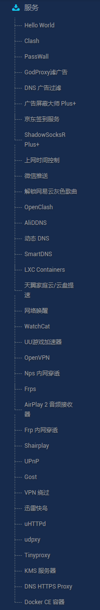

# AutoBuild-OpenWrt
基于[esirplayground/AutoBuild-OpenWrt](https://github.com/esirplayground/AutoBuild-OpenWrt)

IP：10.0.0.1   密码：password

集成一些linux 常用命令: lrzsz、jq、docker-compose、pip、node、git、替换了BusyBox的date命令等等

openssh替换了dropbear, nginx和uhttpd同时存在,默认nginx.   

